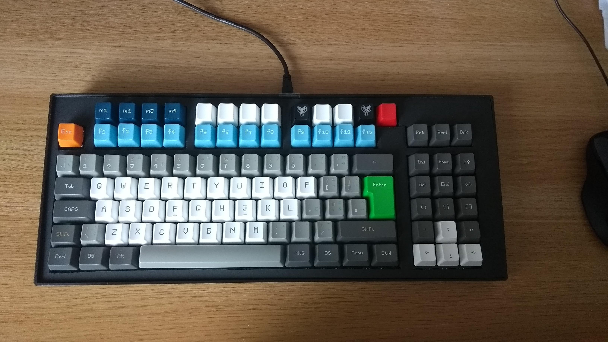

# jzmk
Firmware for an ATmega32u4 based mechanical keyboard - the "jumpifzero mechanical keyboard" (or jzmk). This is a keyboard with an extra row for dynamic macro recording above the Fs and a set of extra keys around the arrows.

# About the firmware
This firmware runs on an ATmega32u4 board, like the Arduino Leonardo or the Arduino Pro Micro. 

The keyboard matrix uses the rows as input and the columns as output which is the opposite way many keyboard matrices are setup. The columns are connected through a cascade of 3 shift registers (e.g. 74HC595).

# Using this firmware
Open jzmk.ino on the arduino IDE and program a board with it.

# Developing and extending the firmware
Read and understand the license.

There is a writeup on how the firmware is structured at: TODO

# Code
Check the `dev` branch.

# Compiling on the command line on Linux
 1. Install the Arduino IDE
 1. Install the avr-gcc toolchain (e.g. for Ubuntu: `sudo apt-get install gcc-avr binutils-avr avr-libc`)
 1. Clone Arduino-Makefile. Example: `cd ~\bin && git clone https://github.com/sudar/Arduino-Makefile.git`
 1. Setup your environment variables (see below)
 1. run `make`
 
## Setup environment variables for compilation
Add the bellow to your `~\.bashrc` Adjusting paths as necessary. 

In my case, whereis avr-gcc reports `\usr\bin\avr-gcc` hence the \usr on `AVR_TOOLS_DIR` and I cloned the Arduino and Arduino-Makefile to `~\bin`.
`
export ARDUINO_DIR=/home/tiago/bin/arduino-1.8.7
export ARDMK_DIR=/home/tiago/bin/Arduino-Makefile
export AVR_TOOLS_DIR=/usr
`    

